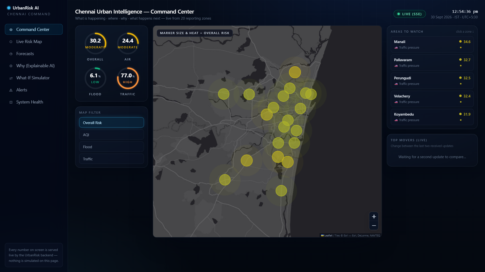
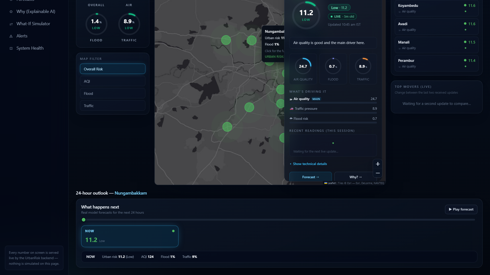
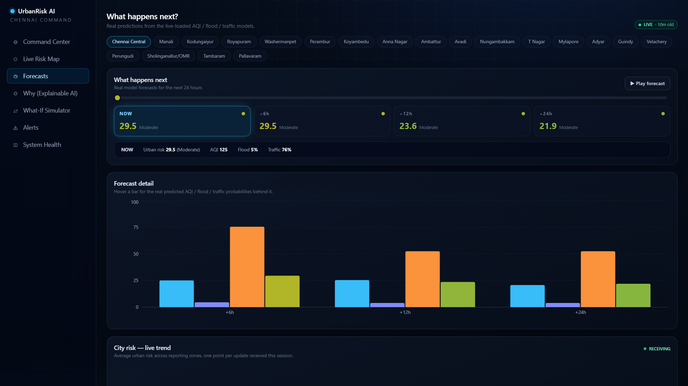

# UrbanRisk AI — Chennai Urban Intelligence Platform

[](https://github.com/Jagrit05/urbanrisk-ai/actions/workflows/ci.yml)
[](LICENSE)


> **Live demo:** Frontend → https://urbanrisk-ai.vercel.app · API docs → https://urbanrisk-backend-4yqu.onrender.com/docs · [Screenshots below](#screenshots) 👇

A real-time urban risk intelligence system for Chennai: machine-learning models
predict **air quality (AQI)**, **flood probability**, and **traffic congestion**
per city zone, fuse them into a single 0–100 **Urban Risk Score**, and stream
the results live into a smart-city command-center dashboard.

## Screenshots

**Command Center** — live Chennai risk map with animated, score-sized markers and heat glow;
city-wide gauges; watchlist. Everything streams over SSE.



**Zone drill-down + forecast playback** — click any marker for the full story: per-signal
gauges, main contributor, live status, and a NOW → +6h → +12h → +24h outlook with play/pause.



**Forecasts** — playback-style timeline across horizons, per-signal forecast detail, and a
live city-trend chart built from received stream frames.



## The full ML lifecycle, end to end

```
training/          backend/               frontend/
M1  AQI models ─┐
M2  Flood models ─┼─►  FastAPI serves ──►  Command-center dashboard
M3  Traffic     ─┤    predictions +     hero map · gauges · forecast
M4  Risk engine ─┘    SSE live stream    playback · explainability
```

| Stage | What happens | Where |
|---|---|---|
| **M1–M4** `training/` | Train XGBoost/RF/LogReg models per signal & horizon; fuse into the 0–100 risk score (Low → Critical) | Jupyter notebooks + artifacts |
| **M5–M8** `backend/` | Serve predictions, SHAP explainability, what-if simulation, alerts; ingest live weather/AQI data; push updates over Server-Sent Events | FastAPI + Postgres + Docker |
| **UI** `frontend/` | Real-time command center: interactive Chennai risk map, animated gauges, forecast playback, drill-down panels | React 18 + TypeScript + Vite |

## Quick start

**1. Backend** (requires Docker):

```bash
cd backend
docker compose up --build
# API on http://localhost:8000 — docs at http://localhost:8000/docs
# Postgres on localhost:5432 (user/pass/db: urbanrisk)
```

The compose file serves the pre-trained models from `backend/model_artifacts/`.
The ingestion worker polls live data sources every 10 minutes; until its first
cycle completes, endpoints return informative "no live observation yet"
responses rather than errors.

**2. Frontend** (requires Node 18+):

```bash
cd frontend
npm install
cp .env.example .env      # defaults to http://localhost:8000
npm run dev               # http://localhost:5173
```

Open the Command Center and the LIVE (SSE) indicator turns green within a few
seconds of the backend starting.

## Deploying (free tier)

**Backend — Render:** this repo ships a [Blueprint](render.yaml).
In Render: **New → Blueprint** → connect this repo → Apply. It provisions a
free Postgres and the backend web service (Docker, models baked into the image).
The backend runs the M6 ingestion loop in-process by default (the free tier
allows only one service), so first live observations land within a minute of
deploying; set `ENABLE_INGESTION=0` to disable it. docker-compose already opts
out and keeps the dedicated worker container.

**Frontend — Vercel:** [frontend/vercel.json](frontend/vercel.json) is ready.
In Vercel: **Add New → Project** → import this repo → set **Root Directory** to
`frontend` → add env var `VITE_API_BASE_URL=https://<your-render-app>.onrender.com`
→ Deploy.

## Repository layout

```
urbanrisk-ai/
├── backend/     # FastAPI API + ingestion worker + ML models + Postgres (Docker)
├── frontend/    # React + TypeScript + Vite dashboard (map-hero command center)
├── training/    # M1–M4 training notebooks + artifacts behind the served models
├── render.yaml  # Render Blueprint (backend + managed Postgres)
└── .github/     # CI: frontend build + backend import/model-load smoke test
```

| Folder | Stack | Details |
|---|---|---|
| `backend/` | FastAPI, SQLAlchemy, Postgres 16, XGBoost/sklearn, APScheduler | REST API (`/api/*`), SSE stream (`/api/stream/dashboard`), ingestion worker, model registry & explainability (SHAP) |
| `frontend/` | React 18, TypeScript, Vite, Tailwind, Leaflet, Recharts | Command-center dashboard with hero map, animated gauges, forecast playback timeline, live charts |
| `training/` | Jupyter notebooks (M1–M4) | AQI / flood / traffic model training + the M4 risk engine; produces the `.joblib` artifacts the backend serves |

See [backend/README.md](backend/README.md), [frontend/README.md](frontend/README.md),
and [training/README.md](training/README.md) for full documentation, endpoint
lists, and architecture notes.

## License

[MIT](LICENSE) — © 2026 Jagrit Kejriwal
